<div align="center">

<!-- Animated Typing Header -->
<a href="https://git.io/typing-svg"></a>

<br/><br/>

<!-- Tech Badges -->


<br/><br/>

<!-- Animated Line -->


</div>

## 🎯 About

A **production-ready** e-commerce microservice with complete **CI/CD pipeline**, **security scanning**, and **Kubernetes deployment**.

<div align="center">

</div>

## 🔄 CI/CD Pipeline

```mermaid
graph LR
    A[📝 Code Push] --> B[🔍 Lint]
    B --> C[🛡️ SAST]
    C --> D[📦 SCA]
    D --> E[🧪 Test]
    E --> F[🔨 Build]
    F --> G[🐳 Docker]
    G --> H[🔎 Trivy]
    H --> I[🚀 Push]
    
    style A fill:#e1f5fe
    style I fill:#c8e6c9
```

<div align="center">


</div>

| Stage | Tool | Purpose |
|:-----:|:----:|---------|
| 🔍 | Checkstyle | Code Quality |
| 🛡️ | CodeQL | Security Scan (SAST) |
| 📦 | OWASP | Dependency Scan (SCA) |
| 🧪 | JUnit | Unit Tests |
| 🐳 | Docker | Container Build |
| 🔎 | Trivy | Container Scan |
| 🚀 | DockerHub | Image Push |

<div align="center">

</div>

## 🚀 Quick Start
```bash
# Clone
git clone https://github.com/indrajeetyadav89/order-management-system.git

# Deploy to Kubernetes
./deploy.sh

# Access
curl http://localhost:8080/api/v1/orders/health
```

<div align="center">

</div>

## 📖 API Endpoints

| Method | Endpoint | Description |
|:------:|----------|-------------|
| `POST` | `/api/v1/orders` | Create order |
| `GET` | `/api/v1/orders` | Get all orders |
| `GET` | `/api/v1/orders/{id}` | Get order by ID |
| `PUT` | `/api/v1/orders/{id}/status` | Update status |
| `PUT` | `/api/v1/orders/{id}/cancel` | Cancel order |
| `DELETE` | `/api/v1/orders/{id}` | Delete order |
| `GET` | `/api/v1/orders/health` | Health check |

📚 **Swagger UI:** `http://localhost:8080/swagger-ui.html`

<div align="center">

</div>

## 🏗️ Architecture
```
┌─────────────────────────────────────────┐
│           🌐 API Layer                  │
│         (OrderController)               │
└──────────────────┬──────────────────────┘
                   │
┌──────────────────▼──────────────────────┐
│           ⚙️ Service Layer              │
│    (OrderService + StateMachine)        │
└──────────────────┬──────────────────────┘
                   │
┌──────────────────▼──────────────────────┐
│           💾 Data Layer                 │
│         (OrderRepository)               │
└──────────────────┬──────────────────────┘
                   │
┌──────────────────▼──────────────────────┐
│           🗄️ Database                   │
│        (H2 / PostgreSQL)                │
└─────────────────────────────────────────┘
```

<div align="center">

</div>

## 🛡️ Security

| Layer | Tool | Scans |
|:-----:|:----:|-------|
| 🔍 SAST | CodeQL | Your Code |
| 📦 SCA | OWASP | Dependencies |
| 🐳 Trivy | Scanner | Container |

<div align="center">

</div>

## 📂 Structure
```
📦 order-management-system
├── 📂 .github/workflows/ci.yml    # CI/CD Pipeline
├── 📂 src/main/java               # Application Code
├── 📂 src/test/java               # Tests
├── 📂 k8s/                        # Kubernetes Manifests
├── 📄 Dockerfile                  # Container Build
├── 📄 deploy.sh                   # Deploy Script
└── 📄 cleanup.sh                  # Cleanup Script
```

<div align="center">

</div>

## ⚡ Commands
```bash
# Deploy
./deploy.sh

# View Pods
kubectl get pods -n order-management

# View Logs
kubectl logs -f deployment/order-management-system -n order-management

# Cleanup
./cleanup.sh
```

<div align="center">

</div>

## 👨‍💻 Author

<div align="center">

**Indrajeet Yadav**

[](https://github.com/indrajeetyadav89)

<br/>

⭐ **Star this repo if you found it helpful!**


</div>
